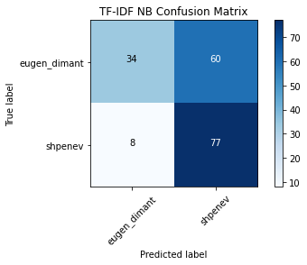

# Homework 9

Thank you to everyone in the Blue Whales for contributing to this project! (Ben Brikman, Arvind Bala, Minglu Xu, Jimena Velazquez, Eva Zhang)

# Introduction:
This submission is for my Data Science And Quantitative Modeling course (BDS 585) for the Master of Behavioral and Decision Sciences (MBDS) program at the University of Pennsylvania. Recently, our class has been learning about text analysis and how to apply it to real tweets. In order to practice what we've learned, my group and I attempted to see if we could create an algorithm that could effectively analyze elements of a tweet and indicate whether it is one of the two people of interest. In our case, the two people of interest are two of the professors from the MBDS program, Alex Shpenev (instructor for BDS-585) and Eugen Dimant (instructor for BDS-501).

# Methodology:
Our method to both learn some text analysis techniques and create the prediction algorithm was: 1) scrape the tweets from the twitter accounts of Alex Sphenev and Eugen Dimant, 2) load libraries that were shown in class, 3) balance out the number of tweets so that they are roughly the same (because Dimant had much more than Shpenev), 4) split the data into train and test data, 5) create several models (leveraging train and test data) and then see how well the accuracy is among the models (shown by naive bayes calculations as well as confusion matrices), 6) plot the most popular words by user (this wasn't for the prediction algorithm, but just an interesting exercise), 7) create and test a prediction algorithm to see the efficacy on related and unrelated tweets.


```python
# Set seed for reproducibility
import random; random.seed(420)
# Import all we need from sklearn
from sklearn.feature_extraction.text import CountVectorizer, TfidfVectorizer
from sklearn.model_selection import train_test_split
from sklearn.naive_bayes import MultinomialNB
from sklearn.svm import LinearSVC
from sklearn import metrics
import pandas as pd
from helper_functions import plot_confusion_matrix

import tweepy
import pandas as pd
import pprint
import json

api_key = 'A62hpXTMmvwnfHQJ5p1FZHhFl'
api_secret = 'JPEHYgLb8q8UG3sCDXcvtd4zhA1hZYTbX2Loi0I0r2EpzkKSFa'
access_token = '1376528038209327104-gnpfeodzdCyf6CZCyq4eHbvIMfXgcW'
access_token_secret = 'zHAnAcYTE6gjaLkWnCXvM0UhGuV8ExQFZGfq4nHO3CtGc'
auth = tweepy.OAuthHandler(api_key, api_secret)
auth.set_access_token(access_token, access_token_secret)
api = tweepy.API(auth)

def get_users_tweets(user_id):
    tweets = api.user_timeline(
        screen_name=user_id, 
        # 200 is the maximum allowed count
        count=200,
        include_rts = False,
        # Necessary to keep full_text 
        # otherwise only the first 140 words are extracted
        tweet_mode = 'extended'
    )
    all_tweets = []
    all_tweets.extend(tweets)
    oldest_id = tweets[-1].id
    while True:
        tweets = api.user_timeline(screen_name=user_id, 
                               # 200 is the maximum allowed count
                               count=200,
                               include_rts = False,
                               max_id = oldest_id - 1,
                               # Necessary to keep full_text 
                               # otherwise only the first 140 words are extracted
                               tweet_mode = 'extended'
                               )
        if len(tweets) == 0:
            break
        oldest_id = tweets[-1].id
        all_tweets.extend(tweets)
        print('N of tweets downloaded till now {}'.format(len(all_tweets)))
    return all_tweets

def raw_tweet_to_df(raw_tweets):
    tweets_clean = {
        'created_at' : [],
        'user_name' : [],
        'full_text' : [],
        'fav_count' : [],
        'rt_count' : []        
    }
    for tweet in raw_tweets:
        tweet = tweet._json
        tweets_clean['created_at'].append(tweet['created_at'])
        tweets_clean['user_name'].append(tweet['user']['screen_name'])
        tweets_clean['full_text'].append(tweet['full_text'])
        tweets_clean['fav_count'].append(tweet['favorite_count'])
        tweets_clean['rt_count'].append(tweet['retweet_count'])
    tweets_clean_df = pd.DataFrame(tweets_clean)
    return tweets_clean_df

alex_raw = get_users_tweets('shpenev')
dimant_raw = get_users_tweets('eugen_dimant')
alex_df = raw_tweet_to_df(alex_raw)
dimant_df = raw_tweet_to_df(dimant_raw)
```

    N of tweets downloaded till now 272
    N of tweets downloaded till now 282
    N of tweets downloaded till now 423
    N of tweets downloaded till now 591
    N of tweets downloaded till now 766
    N of tweets downloaded till now 936
    N of tweets downloaded till now 1083
    N of tweets downloaded till now 1235
    N of tweets downloaded till now 1395
    N of tweets downloaded till now 1556
    N of tweets downloaded till now 1713
    N of tweets downloaded till now 1875
    N of tweets downloaded till now 2017
    N of tweets downloaded till now 2190
    N of tweets downloaded till now 2342
    N of tweets downloaded till now 2490
    N of tweets downloaded till now 2509
    


```python
alex = alex_df
dimant = dimant_df
dimant_sample = dimant.sample(n=270)
shpenev_dimant_trunc = pd.concat([alex, dimant_sample])
shpenev_dimant_df = shpenev_dimant_trunc


# Create target
y = shpenev_dimant_df.user_name

# Split training and testing data
X_train, X_test, y_train, y_test = train_test_split(shpenev_dimant_df['full_text'], y, test_size=0.33, 
                 random_state=53)
```


```python
# Initialize count vectorizer
count_vectorizer = CountVectorizer(stop_words='english', 
                                   min_df=0.05, max_df=0.9)

# Create count train and test variables
count_train = count_vectorizer.fit_transform(X_train)
count_test = count_vectorizer.transform(X_test)

# Initialize tfidf vectorizer
tfidf_vectorizer = TfidfVectorizer(stop_words='english', 
                                   min_df=0.05, max_df=0.9)

# Create tfidf train and test variables
tfidf_train = tfidf_vectorizer.fit_transform(X_train)
tfidf_test = tfidf_vectorizer.transform(X_test)
```


```python
tfidf_nb = MultinomialNB()
tfidf_nb.fit(tfidf_train, y_train)
tfidf_nb_pred = tfidf_nb.predict(tfidf_test)
tfidf_nb_score = metrics.accuracy_score(y_test, tfidf_nb_pred)

count_nb = MultinomialNB()
count_nb.fit(count_train, y_train)
count_nb_pred = count_nb.predict(count_test)
count_nb_score = metrics.accuracy_score(y_test, count_nb_pred)

print('NaiveBayes Tfidf Score: ', tfidf_nb_score)
print('NaiveBayes Count Score: ', count_nb_score)
```

    NaiveBayes Tfidf Score:  0.6536312849162011
    NaiveBayes Count Score:  0.6536312849162011
    

Down below shows the confusion matrices for each model:


```python
%matplotlib inline


tfidf_nb_cm = metrics.confusion_matrix(y_test, tfidf_nb_pred, labels=['eugen_dimant', 'shpenev'])
count_nb_cm = metrics.confusion_matrix(y_test, count_nb_pred, labels=['eugen_dimant', 'shpenev'])

plot_confusion_matrix(tfidf_nb_cm, classes=['eugen_dimant', 'shpenev'], title="TF-IDF NB Confusion Matrix")

# plot_confusion_matrix(tfidf_nb, tfidf_test, y_test, labels=['eugen_dimant', 'shpenev'])
# plot_confusion_matrix(count_nb, count_test, y_test, labels=['eugen_dimant', 'shpenev'])
```

    Confusion matrix, without normalization
    


    

    


```python
plot_confusion_matrix(count_nb_cm, classes=['eugen_dimant', 'shpenev'], title="Count NB Confusion Matrix")
```

    Confusion matrix, without normalization
    


    

    


```python
tfidf_svc = LinearSVC()
tfidf_svc.fit(tfidf_train, y_train)
tfidf_svc_pred = tfidf_svc.predict(tfidf_test)
tfidf_svc_score = metrics.accuracy_score(y_test, tfidf_svc_pred)

print("LinearSVC Score:   %0.3f" % tfidf_svc_score)

svc_cm = metrics.confusion_matrix(y_test, tfidf_svc_pred, labels=['eugen_dimant', 'shpenev'])
plot_confusion_matrix(svc_cm, classes=['eugen_dimant', 'shpenev'], title="TF-IDF NB Confusion Matrix")
# plot_confusion_matrix(tfidf_svc, tfidf_test, y_test, labels=['eugen_dimant', 'shpenev'])
```

    LinearSVC Score:   0.654
    Confusion matrix, without normalization
    


    

    


Down below shows the most popular words for Sphenev and Dimant. It seems that the most popular word is "amp", which I am assuming is an ampersand (&) symbol that was converted to "amp" when collecting the tweet data.


```python
from helper_functions import plot_and_return_top_features
from pprint import pprint

top_features = plot_and_return_top_features(tfidf_svc, tfidf_vectorizer)
pprint(top_features)
```


    

    


    [(-1.4629989461664923, 'amp'),
     (-1.0788628345363696, 'paper'),
     (-1.001803918263373, 'alexoimas'),
     (-0.08602102971546442, 'just'),
     (-0.03635691125099834, 'don'),
     (0.09323212657853495, 'https')]
    

Down below I will test what a prediction algorithm would assume when given statements in different languages (sentences taken from class exercise).


```python
dimant_tweet = "Let's keep America Great!"
shpenev_tweet = "Je voudrais du chocolat"

dimant_tweet_vectorized = tfidf_vectorizer.transform([dimant_tweet])
shpenev_tweet_vectorized = tfidf_vectorizer.transform([shpenev_tweet])

dimant_tweet_pred = tfidf_svc.predict(dimant_tweet_vectorized)
shpenev_tweet_pred = tfidf_svc.predict(shpenev_tweet_vectorized)

print("Predicted Dimant tweet", dimant_tweet_pred)
print("Predicted Shpenev tweet", shpenev_tweet_pred)
```

    Predicted Dimant tweet ['shpenev']
    Predicted Shpenev tweet ['shpenev']
    

Now we will test whether the algorithm will predict correctly when given actual messages posted either from Twitter or Facebook.


```python
new_alex_tweets = ['Can we all just pretend tomorrow is another Sunday?','Wake up dad. Our bowl is empty.']
new_dimant_tweets = ['Don’t miss out on the opportunity to see my amazing mentor & co-author Simon Gächter present new work on the logic of rule following & my friend Nils NCKobis do the academic opening act on cross-cultural corruption (w/@Shaul_Shalvi)Link: http://nobectalks.com #EconTwitter']

for alex_tweet in new_alex_tweets:
    tweet_vector = tfidf_vectorizer.transform([alex_tweet])
    prediction = tfidf_svc.predict(tweet_vector)
    print('Prediction for tweet: {}: {}'.format(alex_tweet, prediction))
    
for dimant_tweet in new_dimant_tweets:
    tweet_vector = tfidf_vectorizer.transform([dimant_tweet])
    prediction = tfidf_svc.predict(tweet_vector)
    print('Prediction for tweet: {}: {}'.format(dimant_tweet, prediction))
```

    Prediction for tweet: Can we all just pretend tomorrow is another Sunday?: ['shpenev']
    Prediction for tweet: Wake up dad. Our bowl is empty.: ['shpenev']
    Prediction for tweet: Don’t miss out on the opportunity to see my amazing mentor & co-author Simon Gächter present new work on the logic of rule following & my friend Nils NCKobis do the academic opening act on cross-cultural corruption (w/@Shaul_Shalvi)Link: http://nobectalks.com #EconTwitter: ['shpenev']
    

Now we will extract new tweets from unrelated users from my Twitter timeline, then test the prediction algorithm on those tweets to see which professor it predicts (either Shpenev or Dimant).


```python
import tweepy
import pandas as pd
import pprint
import json

public_tweets = api.home_timeline()

timeline_tweets = []
for tweet in public_tweets:
    tweet_text = tweet._json
    timeline_tweets.append(tweet_text['text'])
    
counter = 10
for tweet in timeline_tweets:
    tweet_vector = tfidf_vectorizer.transform([tweet])
    prediction = tfidf_svc.predict(tweet_vector)
    print('Prediction for tweet: {}: {}'.format(tweet, prediction))
    counter = counter - 1
    if counter == 0:
        break
```

    Prediction for tweet: RT @chayniaa: how i feel every time i listen to call me by your name https://t.co/BeL5ny4XjO: ['shpenev']
    Prediction for tweet: Get vaccinated, America.: ['shpenev']
    Prediction for tweet: RT @POTUS: Just as India sent assistance to the United States as our hospitals were strained early in the pandemic, we are determined to he…: ['shpenev']
    Prediction for tweet: https://t.co/NsI9cTftzR: ['shpenev']
    Prediction for tweet: RT @chartdata: .@LilNasX's "#MONTERO (Call Me By Your Name)" remains at #1 on the global Spotify chart with 7.63 million streams. It has sp…: ['shpenev']
    Prediction for tweet: https://t.co/WRhy0ad5u2: ['shpenev']
    Prediction for tweet: https://t.co/PzCByT4byZ: ['shpenev']
    Prediction for tweet: you will be hearing from my lawyers https://t.co/HvfLaR860L: ['shpenev']
    Prediction for tweet: WE DID IT GUYS! 
    MONTERO HAS OFFICIALLY REACHED 600K DISLIKES! 🤍🥳
    
    Lil Nas X - MONTERO (Call Me By Your Name) (Offi… https://t.co/RiOjOPDzXm: ['shpenev']
    Prediction for tweet: RT @vulture: Lil Nas X Pentatonixes himself before Pentatonix can Pentatonix him. https://t.co/G0twArKXkW: ['shpenev']
    

# Results: 
For the TFIDF, Count and the SVC model - the naive bayes calculation was just around 65%, meaning the accuracy of predictions were roughly 65% correct (the breakdown true vs. predicted labels is shown by the confusion matrices). As for the prediction algorithm, it predicted Shpenev for every single entry. It did this for Shpenev tweets, Dimant tweets, and for unrelated public tweets. It seems that this was the case because the models correctly predicted many Shpenev tweets (84/85 or 98.8 for the all three models) but correctly predicted much less for Dimant tweets (33/94 or 35.1% for the all three models).

# Conclusion: 
Although our algorithm runs, it seems that our algorithm primarily predicts Shpenev, even when the tweets are from Dimant. For this reason, I consider this algorithm ineffective and in need of further work. Also, one possible issue is the small sample of tweets. If I repeated this algorithm with different people it is possible that I'd get different results.


